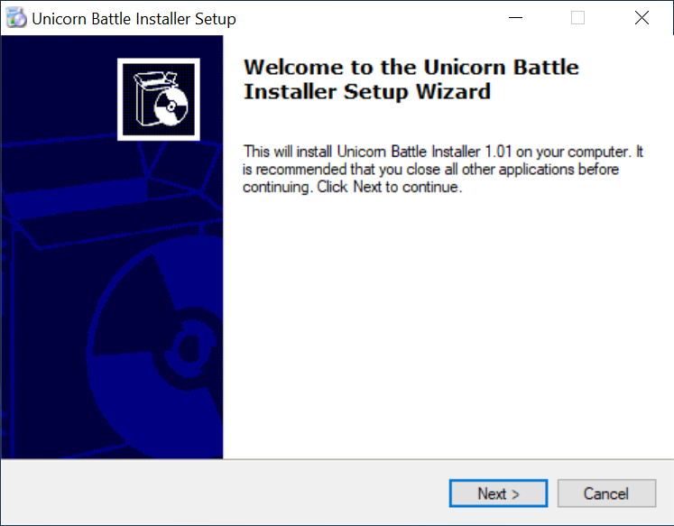
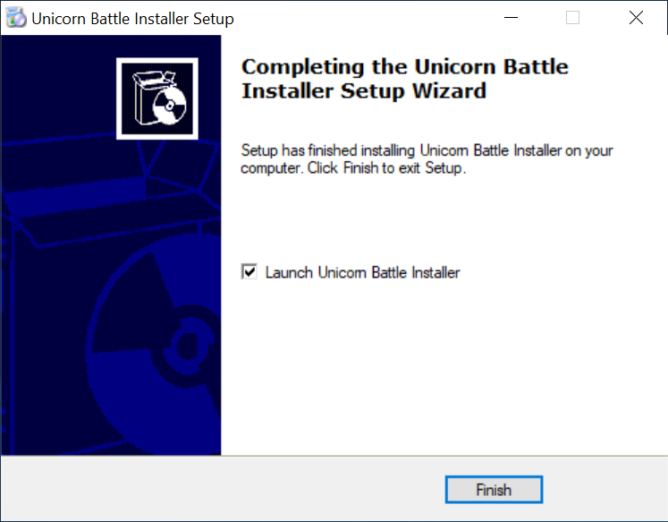
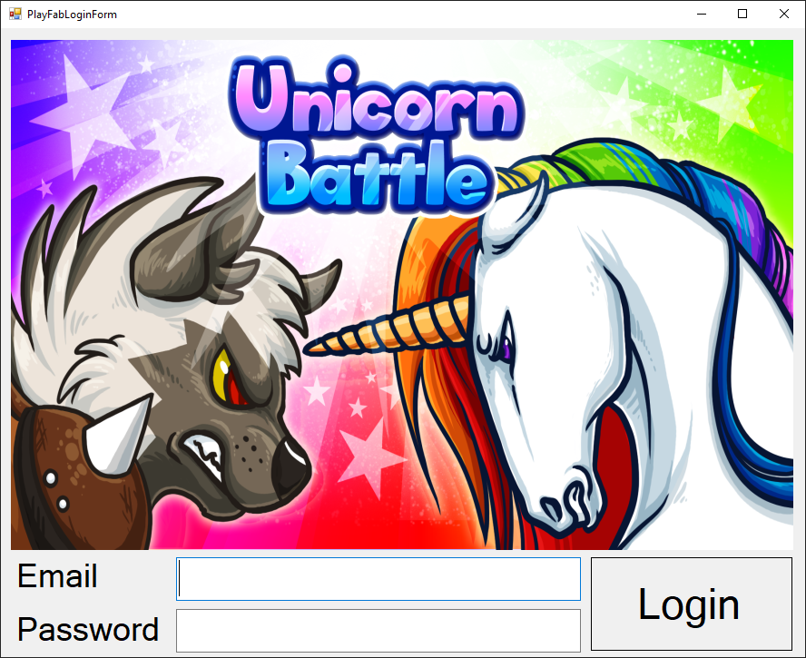
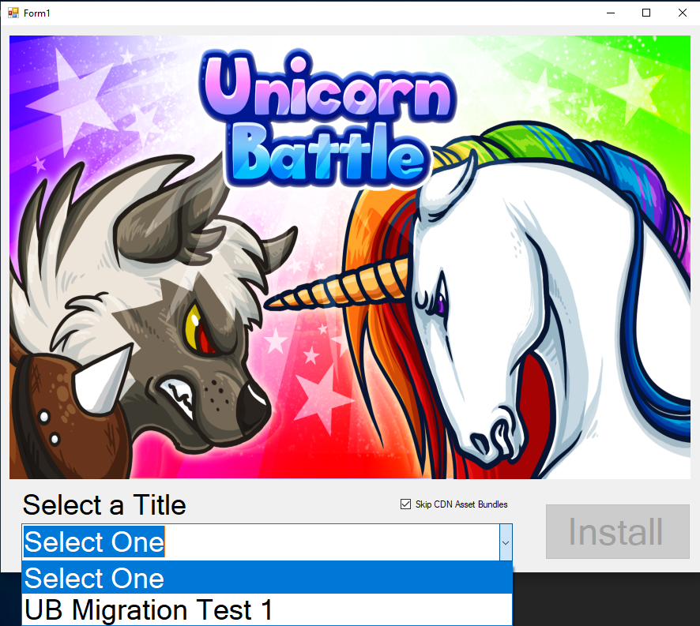

# Unicorn Battle Installer
The Unicorn Battle Installer provides an easy install method to migrate the data needed for Unicorn Battle to a title of your choosing. Previously there were other command line tools, which still exist, to do this migration.  However, now you can perform this migration with ease via the Unicorn Battle Installer program.

# How to install the installer
The easiest way to get the installer is to download it from [here](https://aka.ms/unicornbattleinstaller)

# Installalation and Usage
The install program is a custom developed program that takes configuration data (JSON) for each area of a PlayFab title and copies it to the newly selected title.

1> Install the installer via the [link above](https://aka.ms/unicornbattleinstaller). 

2> Once it has been installed, Launch the Installer Application. Click Finish with "Launch Unicorn Battle Installer" selected.

3> When you launch the Unicorn Battle Installer the following window should appear.

4>  Enter the username and password for your PlayFab Account.  If you do not have a PlayFab account, [please signup for a free account](https://docs.microsoft.com/en-us/gaming/playfab/personas/pfab-account) before proceeding.

5> Once you have created an account and you are logged in to the Unicorn Battle Installer, a list of available titles should show up in the drop down.  
    - Known issue: If you used the wrong username & password, no error occurs, but you have no titles in your dropdown.  Please re-start the application and login with the correct credentials (at least until a fix has been made)

6>  With the title you want to install Unicorn Battle Data to selected, click the **Install** button.

7>  Once the installation is complete, you should be able to see all of your data in the PlayFab title you selected.